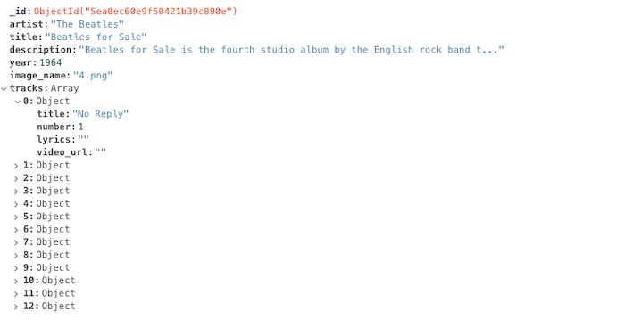
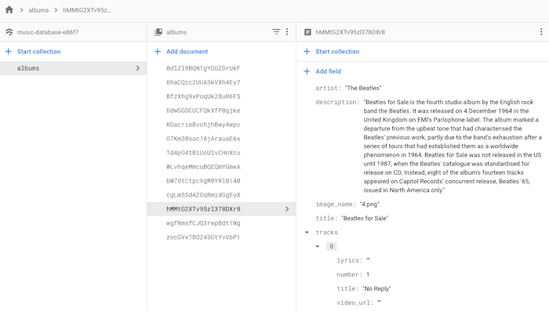
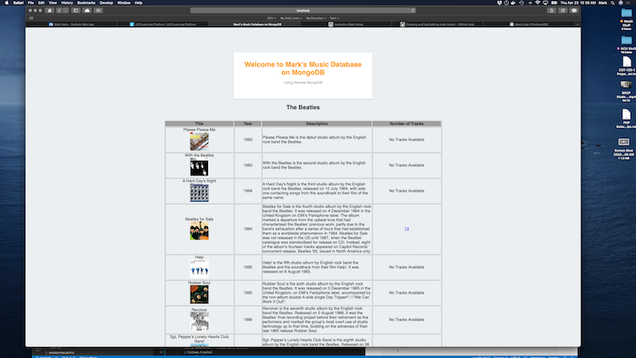
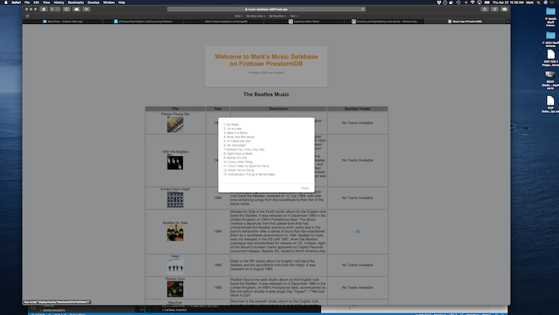

# NoSQL Database Demo Applications
This repository contains some example applications demonstrating the use of [Firebase](https://console.firebase.google.com) (both Realtime and Firestorm databases) and remote [MongoDB](https://www.mongodb.com) (using an account setup on mongo.com). These applications use a simple database schema that represents a music database that is populated with all of [**The Beatles**](https://www.thebeatles.com) albums.

### Example Applications<br>
1. Firebase RealtimeDB in the Firebase/TestApp-RealtimeDB repository is written as a pure HTML and JavaScript application that can be ran with a local firebase server or deployed to the Firebase Hosting service under a sub-domain of app1. You can see the running application [here](https://music-database-e86f7.web.app/app1){:target="_blank" rel="noopener"}.<br>
2. Firebase Firestorm in the Firebase/TestApp-FirestormDB repository is written as a pure HTML and JavaScript application that can be ran with a local firebase server to deployed to the Firebase Hosting service under a sub-domain of app2. You can see the running application [here](https://music-database-e86f7.web.app/app2).<br>
3. MongoDB in the MongoDB/TestApp repository is written as an JavaScript Express application using Pug templating. I have not deployed this application anywhere (yet). <br>

### The Firestorm and MongoDB Database Schemas<br>
On my Firebase account I have a Cloud Firestorm database setup with a Collection named **albums**. Each Document in the Collection represents an Album with object fields of *artist*, *title*, *description*, *image_name*, and array of *tracks*. The Tracks is an array of objects where the fields of the Track object are *title*, *number*, *lyrics*, and *video_url*.<br><br>
On my MongoDB account I have a databse setup named **mymusic** with a Collection named **albums**. Each Document in the Collection represents an Album with object fields of *artist*, *title*, *description*, *image_name*, and array of *tracks*. The Tracks is an array of objects where the fields of the Track object are *title*, *number*, *lyrics*, and *video_url*.<br>
<br> It should be noted that there is a "sample" [schema](https://github.com/markreha/nosql/blob/master/SampleDatabase/music-database-single-document.json) in the repository but it is just a single document and should only be used as reference for the object fields and music data. A better design is the multiple document [schema](https://github.com/markreha/nosql/blob/master/SampleDatabase/music-database-multiple-documents.json) also found in this repository.<br>
<br>The following are screenshots of each schema:<br> 
| MongoDB Schema | Firestorm Schema |
|     :---:      |    :---:         |
| -------------  | -------------    |
|   |  


### Application Screenshots<br>
The following are screenshots from each application:<br> 
| MongoDB Demo App | Firestorm Demo App |
|     :---:        |    :---:           |
| -------------    | -------------      |
|   |  

### Application Code<br>
* [Firestorm Main Application Page](https://github.com/markreha/nosql/blob/master/Firebase/TestApp-FirestormDB/public/index.html)
* [MongoDB Main Express Script](https://github.com/markreha/nosql/blob/master/Mongodb/TestApp/app.js) and [Pug Template Page](https://github.com/markreha/nosql/blob/master/Mongodb/TestApp/views/index.pug)

### Application Code Snippets<br>
<details><summary>Click to View</summary>
<p>

#### Application Code Snippet for Firestorm<br>
```javascript
      // Query the Database for Albums and dispaly then in a dynamic HTML table
      function displayAlbums()
      {
      	// Get all the Albums from the Database where artist is The Beatles, sort the results by Year then Title
      	firebase.firestore().collection("albums").where("artist", "==", "The Beatles").orderBy("year").orderBy("title").get()
      	.then((querySnapshot) => 
      	{
       			// For each Document returned display the Album
    			querySnapshot.forEach((doc) => 
    			{
					displayAlbum(doc.data());
   					console.log(doc.data().artist + ' ' + doc.data().title);
    			});
		})
		.catch(function(error) 
		{
    		console.error("Error querying document: ", error);
		});
      }
      
      // Insert a row into the Albums HTML table and populate its cells
      function displayAlbum(album)
      {
      	// Dynamically insert a row and cells in the Albums HTML table
 		var table = document.getElementById("albums");
		var row = table.insertRow(-1);
		row.setAttribute("align", "center");
		var cell1 = row.insertCell();
		var cell2 = row.insertCell();
		var cell3 = row.insertCell();
		var cell4 = row.insertCell();
		cell3.style.textAlign = "left";
		
		// Display the Album info in each of the HTML row cells then setup a JavaScript call on the tracks anchor tag
		cell1.innerHTML = album.title + "<br/>" + "";
		cell2.innerHTML = album.year;
		cell3.innerHTML = album.description;
		if(album.tracks)
			cell4.innerHTML = "<a href=" + "'javascript:displayTracks(\"" + album.title + "\"" + ")'>" + album.tracks.length + "</a>";
		else
			cell4.innerHTML = "No Tracks Available";
		        
        // Hide Loading Progress
		document.getElementById("progress").style.visibility = "hidden"; 
	  }
	  
	  // Display the Album Tracks
	  function displayTracks(title)
	  {
      	// Get all the Albums from the Database where artist is The Beatles, sort the results by Year
      	firebase.firestore().collection("albums").where("artist", "==", "The Beatles").where("title", "==", title).orderBy("year").get()
      	.then((querySnapshot) => 
      	{
      			// For each Document concatenate all the Tracks and display the results in an alert box
    			querySnapshot.forEach((doc) => 
    			{
					var tracks = "";
					for(var track of doc.data().tracks)
						tracks = tracks + track.number + ". " + track.title + "\n";
					alert(tracks);
					return;
    			});
		})
		.catch(function(error) 
		{
    		console.error("Error querying document: ", error);
		});
	  }
```
#### Application Code Snippets for MongoDB<br>
```javascript
// Main Application Entry Path
app.get('/', function (req, res) 
{
	// Connect to MongoDB
	mongo_client.connect(mongodb_uri, function(err, client) 
	{
		// If Connection OK	
  		if(!err) 
  		{
  			// Get the Albums Collection from the My Music Database
    		console.info("Connected on MongoDB.");
    		var collection = client.db("mymusic").collection("albums");
    		
    		// Run the Query and sort it by year
			collection.find({"artist": artist}).sort({"year":1}).toArray(function(err, albums)
    		{
    			if(!err)
    			{
					// Display the Albums in a View
					console.info("Finished getting all the albums");
					displayAlbums(res, artist, albums);
				}
				else
				{
					// Error
  					console.error("We failed to get the albums from MongoDB");
  					res.end("Exception connecting to database " + err.message);
				}
			});			
			client.close();
  		}
  		else
  		{
  			// Error
  			console.error("We failed to connect to MongoDB");
  			res.end("Exception connecting to database " + err.message);
  		}
	});
});
```
```pug
	body
		// Welcome Message
		div#message(align='center')
			h2 Welcome to Mark's Music Database on MongoDB
			p#load Using Remote MongoDB
 
		// Display Albums for the Artist
		div(align='center')
			h2= artist
			br
			// Album Table
			table(style='width:50%', border='1')
				// Header Row
				tr(style="background-color:#A0A0A0")
					th(width="25%") Title
					th(width="10%") Year
					th(width="40%") Description
					th(width="25%") Number of Tracks
				// For each Album display a new Row
				each album in albums
					tr
						// Title Column
						td(align="center")= album.title 
							br 
							img(src="/images/" + album.image_name width="75px" height="75px")
							
						// Year Column
						td(align="center")= album.year
						
						// Description Column
						td(align="left")= album.description
						
						// Tracks Column
						if album.tracks && album.tracks.length
							// Tracks available so sort the tracks by number, concatenate and escape tracks as a single string, then display
							- album.tracks = album.tracks.sort(function(a, b){return a.number - b.number})
							- var tracksList = ""
							each track in album.tracks
								- tracksList = tracksList + track.number + ". " + track.title.replace('\'', '\\"') + '\\n'
							td(align="center")
								a(href="javascript:displayTracks('" + tracksList + "')")= album.tracks.length
						else
							// No tracks available
							td(align="center")=	"No Tracks Available"
```							

</p>
</details>

